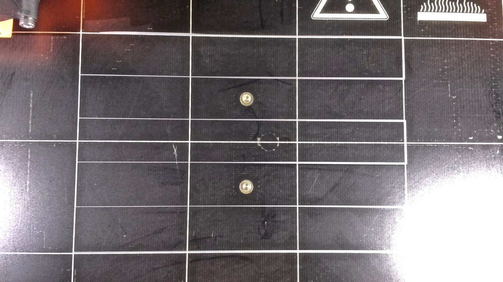

# Bed Level Problems...

After assembling my Prusa MK2S kit I am experiencing a problem with getting even first layers. For some reason, the prints are higher up from the bed on the left than on the right.

## V2Calibration gcode

The calibration print is 'squished' on the right side and sticks well to the bed. The lines get thinner as they go to the left. The lines on the left are not 'squished' and don't stick to the bed.

## Here is the bottom of the tree frog included print.
The left side of the print is not well-attached to the bed, the right side is printed very nicely on the first layer.

## And the mess after Removing the Bearing
