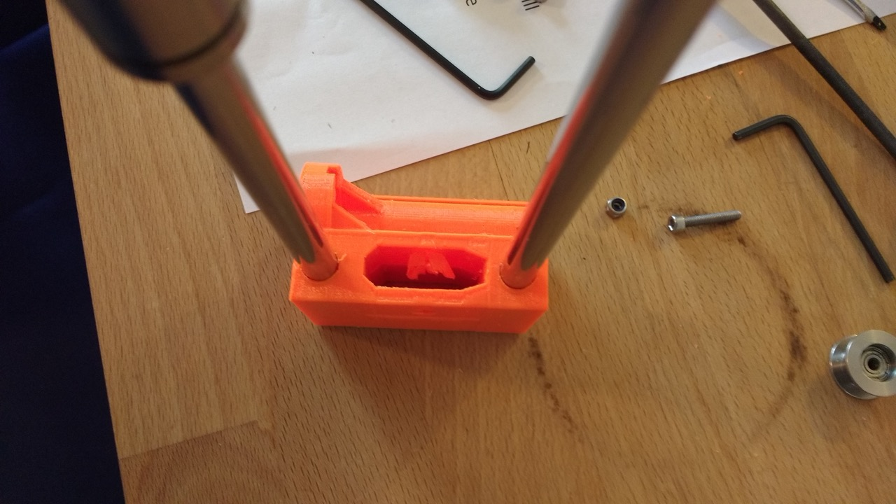

# X-end Idler Assembly Troubles

While assembling my Prusa MK2S kit I hit a snag at [step 7](http://manual.prusa3d.com/Guide/3.+X-axis+assembly/299#s5109) of the X-axis assembly. The problem is that the hexagonal nylock nut didn't fit into its groove at all. Some tips in the comment section of the assembly instructions advised to try and push it in with pliers while tightening the M3 hex screw from the other side.

When I tried this the nut didn't seat - rather, I heard a pretty disheartening **crack** --- the sound of the head of the screw breaking through the plastic of the X-end idler and trapping the bearing!

If the comments on the assembly manual are anything to go by, then I'm not the only one encountering problems with seating that nylock nut in its groove. I really hope the good folks at Prusa Research take a look at adjusting the tolerances on the X-end idler.

I managed to hack together a (temporary?) fix by filing away the broken plastic and using a countersunk M3 screw and a washer to keep the screw from falling into the hole. I haven't finished assembling the kit yet, so I'm not sure if this will work. My main worry is that the screw isn't flush enough against the X-axis idler, potentially making problems later when I assembly the Z-axis.

## Bearing Stuck

Here's the bearing stuck after the hex screw did its damage...

## And the mess after Removing the Bearing

## And my Attempt at a fix

