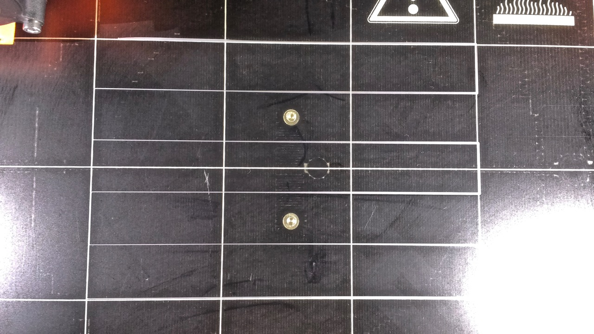
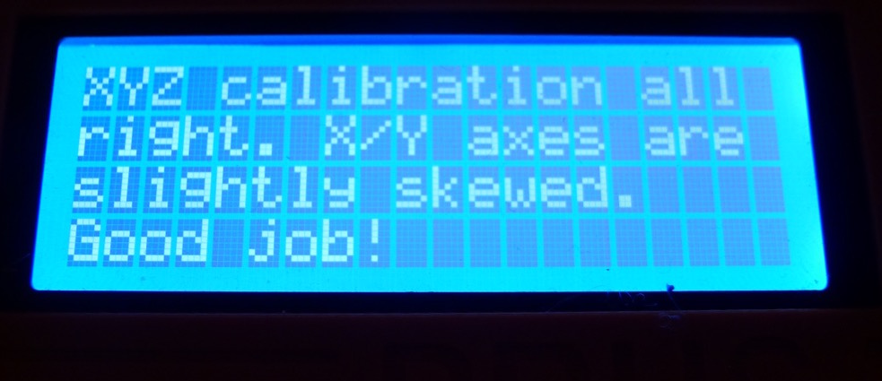

In November 2017 I decided to take the plunge into the world of 3D printing, and, after much online research decided to go with a Prusa. At the time Prusa had two main models on offer - the MK2S and the newly released MK3. Both printers are available as kits or pre-assembled. The price of the MK2S was around €150 lower than the MK3.

I decided to buy the MK2S because it seemed like a safer bet going with a printer design that had been around longer and whose issues were known. I also decided to purchase the kit rather than the pre-assembled printer under the advice of my friend - a 3D printer fanatic (and a huge fan of Prusa Research). My friend recommended getting a kit because the assembly process of the printer is and important way to 'know your machine', this DIY know-how would be especially important later for tweaking and calibrating the printer.

* [Beginning Assembly](#assembly)
* [X-end Idler Issue](#x-end-troubles)
* [Missing Z Axis Part](#missing-z-axis-part)
* [Broken Bolts](#broken-bolts)
* [Printing Layer Height Issue](#bed-level-problem)

# Beginning Assembly 
__*Nov 7*__
My printer arrived promptly in the first week of November and I started the first weekend I could building it. The kit itself comes with a detailed assembly manual - I found Prusa's [online MK2S manual](http://manual.prusa3d.com/c/Original_Prusa_i3_MK2S_kit_assembly) to be an extremely valuable resource. Every step includes tips from the user community for how to improve the assembly experience - which saved me a few times from making mistakes.

# (Step 7) X-end Idler Assembly Troubles 
__*Nov 8*__
At [step 7](http://manual.prusa3d.com/Guide/3.+X-axis+assembly/299#s5109) of the X-axis assembly I hit a problem. In this step you have to insert a hexagonal nylock nut into a hexagon-shaped groove on a 3D-printed part, however the nut would not fit into the groove at all. Some commenters on the assembly manual were also having issues with this step - apparently the tolerance on these 3D-printed parts isn't so good.

One comment advised trying to push in the nut with pliers while tightening the M3 hex bolt from the other side. So I gave this a try. However, this didn't get the nut into its groove - rather, I heard a pretty disheartening **crack** --- which was the sound of the bolt head breaking through the plastic of the part and trapping the bearing+pulley wheel inside!

#### Here's the bearing stuck after the hex screw did its damage...

### Solution(a hack that seemed to work)...

As a solution I filed away the broken plastic inside the part and using a countersunk M3 screw, plus a washer to keep the screw from falling into the hole.

At this point I haven't finished assembling the kit yet, so I'm not sure if this 'fix' will cause some issues later when I start printing and calibrating. But overall it seems to be quite sturdy and the screw is nearly flush with the part.

#### Here's the mess after removing the bearing:

#### And my repair job using a washer and countersunk screw

# Duplicate Z-axis part
__*Nov 8*__ Moving on.. I reached [section 4](http://manual.prusa3d.com/Guide/4.+Z-axis+assembly/296?lang=en) in the assembly manual on building the Z-axis. Here I ran into a snag because my kit was missing one [of the parts](http://manual.prusa3d.com/Guide/4.+Z-axis+assembly/296?lang=en#s5014) that holds the Z-axis motors against the aluminum frame.

I contacted Prusa and they apologized and offered to send me the missing part - as well as offered me a 20% discount on a filament purchase. Strangely enough.. Prusa sent me the filament but *not* the missing parts. I contacted them about the missing parts and they were apologetic again, and sent me the missing parts.

## Replacement parts arrived!
__*Dec 2*__ Finally my Z-axis right end is here. Now back to assembling the printer!

# Broken bolts in aluminum frame
__*Jan 5*__ Nearly at the end of the printer assembly I hit a huge problem. While screwing the electronics case into the aluminum frame I had a bolt get stuck and break.

http://manual.prusa3d.com/Guide/8.+Electronics+assembly/279?lang=en
http://manual.prusa3d.com/Guide/8.+Electronics+assembly/279?lang=en#s4759

I really kicked myself after this happened! Multiple people in the assembly manual left comments that the aluminum frame was not properly tapped, and that they had broken bolts in an earlier step while assembling the Z-axis.

It's true that the bolts did not go in easily when I assembled the Z-axis. I should have taken that as a warning, but I didn't want to spend the extra money on a M3 tap set - especially with the comments from Prusa reps saying that the screws should go in just fine...

This issue led me to looking for solutions online for removing a broken screw. I came up with a few options (and tried all of them!):

### 1. notch & screwdriver
The easiest suggestion I found was to cut a notch in the bolt head using a dremel. Once you have this notch, theoretically you can unscrew the bolt using a flathead screwdriver.

unscrewing it using a flathead screwdriver (the bolt was in too deeply)

### 2. drilling out the screw
drilling out the bolts (they're stainless steel, none of my drilling tools or bits could do it)

Drilling...

### 3. dissolve the bolt with alum (the most desperate)
dissolving the bolt using alum (left two days with a tealit alum solution... no effect)

# No luck... now what?
__*Jan 11*__ sadly none of these methods worked, so in desperation I contacted Prusa again to ask for help. They (very graciously!) sent me a replacement aluminum frame free of charge. I can say that many things about this assembly have been frustrating, but the response from Prusa Research has been *superb every time*.

I can only imagine what a nightmare this would have been if I had purchased a Chinese Prusa knock-off with poor customer support.

At this point I figured I had dont everything I could possibly do (and it's been two months since I've been building this kit with still no functional printer).. I contacted Prusa to ask for a replacement frame. As always their customer support was very gracious.. despite all the troubles I've run into building this kit, I still  have high regards for the way they treat their customers.

# Tapping the Frame This Time
__*Jan 13*__

#### Tapping the frame using an M3 tap (purchased at the local hardware store - it was rather expensive! --- but once you use it, the bolts go into the aluminum easily and secure tightly, a huge difference!)
I posted this recommendation on the instructions page...

# Layer Height and Bed Level Problems...
### Really helpful Prusa MK2S owners facebook page..

### Trying to fix this problem....
* Reassembly of Y-axis to get 'perfect alignment'
* Multiple adjustments of the PINDA probe
* Moving the printer to different surfaces (table tops which may be more flat), and recalibrating the printer afterwards
* reassembling the printbed/Y-axis connection

#### Caliper measurements show a 1mm difference in height between the left and right side of the bed, but the PINDA Z calibration should resolve this? No?
To be honest I'm now really regretting not purchasing the slightly more expensive MK3. A friend of mine purchased the MK3 and had his printer up and working in two days. The y-axis frame seems to be a much better design than on the MK2S - which I have had to repeatedly adjust, to the point of even rebuilding the whole thing.. and I can only assume part of my bed height problems are due to the instability of the Y-axis design. At this point I am ready to give up... if you have any suggestions for solving this problem please help!

After assembling my Prusa MK2S kit I am experiencing a problem with getting even first layers. For some reason, the prints are higher up from the bed on the left than on the right.

Getting the right Z-adjust Level
https://shop.prusa3d.com/forum/prusa-i3-kit-building-calibrating-first-print-main-f6/life-adjust-z-my-way-t2981.html

possibly the y-axis is somehow offkilter (right side higher than the left) ... the pinda is not capable of adjusting for this
https://www.reddit.com/r/3Dprinting/comments/5ximfs/is_the_prusa_i3_mk2_mesh_bed_levelling_not_real/

Video of guy with same issue:
<iframe width="560" height="315" src="https://www.youtube.com/embed/VqgqAyFAb7I" frameborder="0" allow="autoplay; encrypted-media" allowfullscreen></iframe>

## V2Calibration gcode

The calibration print is 'squished' on the right side and sticks well to the bed. The lines get thinner as they go to the left. The lines on the left are not 'squished' and don't stick to the bed.

Apologies for the image - the filament is grey so it is a bit difficult to see against the print bed.

## Here is the bottom of the tree frog included print.
The left side of the print is not well-attached to the bed, the right side is printed very nicely on the first layer.

## Attempts at Troubleshooting

### Live-Z Adjust

# XYZ Calibration, Adjusting the Frame

### Z Calibration

### Triple Checking XYZ / Z Calibration

### Rebuilding/Tightening the Frame

### Bed Level Adjust

# Still no luck.. now what?
