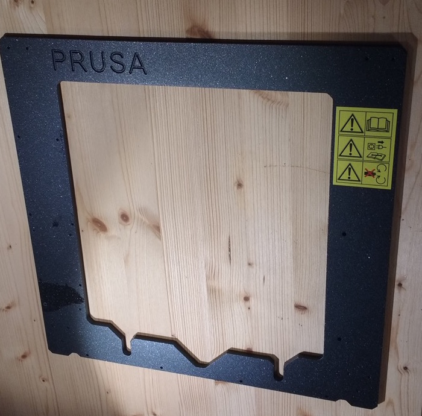
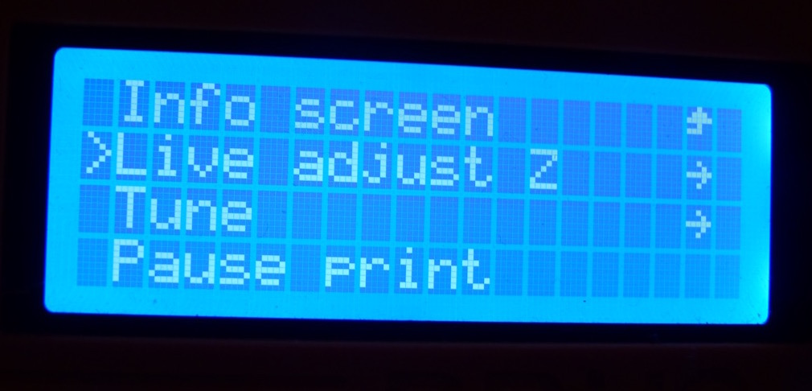
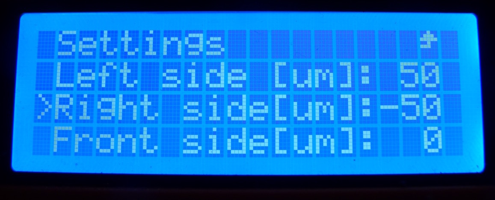

In November 2017 I decided to take the plunge into the world of 3D printing, and, after much online research decided to go with a Prusa. At the time Prusa had two main models on offer - the MK2S and the newly released MK3. Both printers are available as kits or pre-assembled. The price of the MK2S was around €150 lower than the MK3.

I decided to buy the MK2S because it seemed like a safer bet going with a printer design that had been around longer and whose issues were known. I also decided to purchase the kit rather than the pre-assembled printer under the advice of my friend - a 3D printer fanatic (and a huge fan of Prusa Research). My friend recommended getting a kit because the assembly process of the printer is and important way to 'know your machine', this DIY know-how would be especially important later for tweaking and calibrating the printer.

* [Beginning Assembly](#assembly)
* [X-end Idler Issue](#x-end-troubles)
* [Missing Z Axis Part](#missing-z-axis-part)
* [Broken Bolts](#broken-bolts)
* [Printing Layer Height Issue](#bed-level-problem)
* [Ongoing problems with bed level](#bed-level-ongoing)

# Beginning Assembly 
__*Nov 7*__
My printer arrived promptly in the first week of November and I started the first weekend I could building it. The kit itself comes with a detailed assembly manual - I found Prusa's [online MK2S manual](http://manual.prusa3d.com/c/Original_Prusa_i3_MK2S_kit_assembly) to be an extremely valuable resource. Every step includes tips from the user community for how to improve the assembly experience - which saved me a few times from making mistakes.

# (Step 7) X-end Idler Assembly Troubles 
__*Nov 8*__
At [step 7](http://manual.prusa3d.com/Guide/3.+X-axis+assembly/299#s5109) of the X-axis assembly I hit a problem. In this step you have to insert a hexagonal nylock nut into a hexagon-shaped groove on a 3D-printed part, however the nut would not fit into the groove at all. Some commenters on the assembly manual were also having issues with this step - apparently the tolerance on these 3D-printed parts isn't so good.

One comment advised trying to push in the nut with pliers while tightening the M3 hex bolt from the other side. So I gave this a try. However, this didn't get the nut into its groove - rather, I heard a pretty disheartening **crack** --- which was the sound of the bolt head breaking through the plastic of the part and trapping the bearing+pulley wheel inside!

#### Here's the bearing stuck after the hex screw did its damage...

### Solution(a hack that seemed to work)...

As a solution I filed away the broken plastic inside the part and using a countersunk M3 screw, plus a washer to keep the screw from falling into the hole.

At this point I haven't finished assembling the kit yet, so I'm not sure if this 'fix' will cause some issues later when I start printing and calibrating. But overall it seems to be quite sturdy and the screw is nearly flush with the part.

#### Here's the mess after removing the bearing:

#### And my repair job using a washer and countersunk screw

# Duplicate Z-axis part
__*Nov 8*__ Moving on.. I reached [section 4](http://manual.prusa3d.com/Guide/4.+Z-axis+assembly/296?lang=en) in the assembly manual on building the Z-axis. Here I ran into a snag because my kit was missing one [of the parts](http://manual.prusa3d.com/Guide/4.+Z-axis+assembly/296?lang=en#s5014) that holds the Z-axis motors against the aluminum frame.

I contacted Prusa and they apologized and offered to send me the missing part - as well as offered me a 20% discount on a filament purchase. Strangely enough.. Prusa sent me the filament but *not* the missing parts. I contacted them about the missing parts and they were apologetic again, and sent me the missing parts.

## Replacement parts arrived!
__*Dec 2*__ Finally my Z-axis right end is here. Now back to assembling the printer!

# Broken bolts in aluminum frame
__*Jan 5*__ Nearly at the [end of the printer assembly](http://manual.prusa3d.com/Guide/8.+Electronics+assembly/279?lang=en#s4759) I hit a huge problem. While screwing the electronics case into the aluminum frame I had a bolt get stuck and break.

I really kicked myself after this happened! Multiple people in the assembly manual left comments that the aluminum frame was not properly tapped, and that they had broken bolts in an earlier step while assembling the Z-axis.

It's true that the bolts did not go in easily when I assembled the Z-axis. I should have taken that as a warning, but I didn't want to spend the extra money on a M3 tap set - especially with the comments from Prusa reps saying that the screws should go in just fine...

This issue led me to looking for solutions online for removing a broken screw. I found a few options (and tried all of them)..

### 1. notch & screwdriver
The easiest suggestion was to use a dremel tool to cut a notch in the bolt head. Once you have this notch, you can unscrew the bolt using a flathead screwdriver.

Luckily I have a dremel with cutting disks, so this is the option I tried first. However, the bolt was in too deeply and I wasn't able to get it to budge at all with the screwdriver.

### 2. drilling out the screw/using a screw remover
The second option was to use a fine drill bit to drill out the bolt, and (optionally) use a screw extractor ([something like this](http://www.silverlinetools.com/en-GB/Products/Mechanical%20Engineering/Threading%20Tools/DA70)) to pull the bolt out.

I went to the hardware store and bought a tungsten carbide HSS 2mm drill bit along with a M3 screw extractor. However I couldn't get the bit to dig into the bolt no matter what... the bolt, as it turns out, is stainless steel.. notoriously difficult to drill into.

### 3. dissolve the bolt with alum (the most desperate)
Finally a friend recommended that I should try dissolving the bolt with alum. This is an old trick she used when a steel bolt would get rusted and stuck into a piece of aluminum... if left soaking in an alum solution for long enough, the steel dissolves but the aluminum would not.

This video shows someone going through the process of dissolving a steel bolt stuck in an aluminum block, using a soda can, a light bulb (for heat) and an alum solution:
<iframe width="560" height="315" src="https://www.youtube.com/embed/fqZYgReuywM" frameborder="0" allow="autoplay; encrypted-media" allowfullscreen></iframe>

I built my own soda-can rig and bought some alum from a mineral supply store online. I left the bolt soaking in an alum solution for two days (heated by a tealight underneath). However, after two days the bolt still hadn't shown any signs of dissolving - and the alum was crystallizing out of solution all over the place and making a big mess.

# No luck... now what?
__*Jan 11, 18*__ Nothing seemed to get the bolt out, and at this point it felt like I had done everything I could. It's been almost two months building this kit and still no functional printer... so in desperation I decided to contact Prusa again.

The response from Prusa Research was *superb* -
they (very graciously!) sent me a replacement aluminum frame free of charge. Despite all the frustration I'm still very impressed with Prusa's commitment to supporting their customers and community.

# Tapping the new Frame
__*Jan 15, 18*__ The new aluminum frame arrived. But this time I decided not to take any chances and purchased an M3 tap set at the local hardware store (you can also easily find them [online](https://www.amazon.com/Drill-Warehouse-Adjustable-T-Handle-Thread/dp/B0736T5NM6/)). Once I tapped the holes on the new frame the bolts went in easily and secured tightly, a huge difference.

I really hopes Prusa finds a better way of tapping these holes in manufacturing, because they seem to be creating an issue for many people when assembling these kits. I [posted a recommendation](http://manual.prusa3d.com/Guide/4.+Z-axis+assembly/296?lang=en#s5013) on the instructions page to tap the holes before assembling the Z-axis... hopefully others take the advice that I had to learn the hard way.

In either case, with a new aluminum frame and lessons learned I'll try to finish building the printer tonight.

# Printer Calibrations
__*Jan 16, 18*__ After tapping the M3 holes in the frame the rest of the kit assembly was a breeze. In their [3D Printing Handbook](www.prusa3d.com/3dhandbookMK2S),  Prusa recommends a few calibration routines after assembly.

First I adjusted the PINDA probe height using a zip-tie as a spacer. It's important that the PINDA probe isn't too high, or else it won't detect the metal markers inside the bed and could potentially send the nozzle into the bed, damaging it.

The self-test worked without issue. And I was able to calibrate the XYZ axis as well: although I got the message that my axis were skewed. But the firmware will compensate for the axis skew like magic.

After loading the filament I printed the V2calibration test print to get the height of the nozzle fine tuned.

   

#### Here's the first try:

The V2calibration prints a line zig-zagging from left to right across the print bed. It *should* be alined with the measurement lines on the printbed, and the goal is to adjust the nozzle (using Live-Z adjust) until it's close enough to the bed that it produces a nice, solid, even line that sticks well to the bed.

To judge the nozzle height in the calibration print I found this image really helpful:

You can see in my first print that the filament is not sticking to the board, like in the top image. If I just lightly touch it, the filament comes right off.

The next thing to do is try the V2calibration again and again, using the Live-Z adjust setting while the print is going to lower the nozzle until it's at a good height. The V2calibration print has a special setting in it that saves the Z-adjustment value to be used in future prints.

I had used an Ultimaker Original in the past, and I remember having to do this using a piece of paper and manually adjusting screws on the bed. I'm really impressed that Prusa has been able to integrate this annoying part of maintenance into the firmware.

   
   

I found that by lowering the nozzle I was able to get good adhesion on the right side of the print bed, but on the left side I was still getting lines that wouldn't stick. If I lowered the nozzle more eventually the lines on the left would stick, but the lines on the right side of the bed would start having problems with being too close to the bed (nozzle almost digging into the build plate).

After a few tries I settled on lowering the nozzle by 0.3mm.

   

#### Here's the result after some tweaking..

It's a bit hard to see with the silver filament, but you can see how the printed lines are much thicker on the right side of the board than on the left side. It's especially visible in the lower two lines.

Unfortunately the lines on the left side at this point were still having problems sticking (I could easily disconnect them from the bed just by touching them). Although they were sticking a bit better than in the first try.

The [3D printing handbook](#printing-handbook) specifically mentions this problem in the workflow - and suggests looking at the chapter on Bed level correction.

## Bed Level correction

Bed Level correction is a new feature of firmware 3.0.6+ that allows you to correct small inconsistencies in the nozzle height at the back, left, right, and front of the print bed. I adjusted the left side correction to +50u (raising the bed by 50microns) and a right side correction of -50u. These are the maximum values allowed.

After dialing in these values I made another V2calibration print and saw no improvement. My conclusion is that the inconsistency in my bed (or some other part of the printer?) is significantly larger than 50um.

## Printing a few things...

It's been two months of building this printer so I wanted to just get started and try printing things. The first thing I printed was the recommended Prusa logo, provided on the included SD card. The logo turned out alright, with some curling up on the left (my guess is that this is due to the nozzle height issue).

I then tried to print the treefrog, which became detached from the bed during printing. The left side of the frog was curling up a bit just like the Prusa logo.. Looking at the bottom you can see an obvious difference in the solidness of the print on the left and right. This again makes me think the nozzle/bed height inconsistency is part of what's going wrong.

  
  

# Ongoing Layer Height and Bed Level Issues

__*Jan 31, 18*__ I've been trying to design my own 3D parts over the last week. Slicing using [Cura](https://ultimaker.com/en/products/ultimaker-cura-software). However the problem with the bed level between the left and right side of the printer continues to be a problem.. here's one of the first parts I designed, which again has issues with the left side sticking to the bed and not warping.

I first wanted to take a measurement of the nozzle height at different points on the bed.

My measurements showed up a 0.5-2mm difference in height between points.. the difference was greatest between the left and right side of the bed (the left side was significantly lower, no surprises there).

But the Z calibration should resolve this? Right? That's what I thought.. something weird must be going on.

Josef Prusa gives some good advice for aligning the z, x, and y axes:
<iframe width="560" height="315" src="https://www.youtube.com/embed/JqH41K2vq0g?start=296" frameborder="0" allow="autoplay; encrypted-media" allowfullscreen></iframe>

The internet is, naturally, also full of helpful people willing to share their knowledge and experience. I found one especially helpful community on the [MK2S owners facebook page](https://www.facebook.com/groups/prusai3mk2owners/) (worth joining for all Prusa owners!)

I got a lot of advice here for trying to diagnose the problem, here's a few I decided to try...

1. Try reassembly of the Y-axis to get 'perfect alignment'
2. try adjusting the screw connections between the printbed and Y-axis
3. try adjusting the PINDA probe
4. moving the printer to different surfaces (table tops which may be more flat), and recalibrating the printer

I tried all of these. First moving the printer to a better surface. Previously my printer was on a large wooden workbench and I moved it to a more solid, smaller, lower table with a flatter top.

I then totally disassembled and reassembled most of the printer (everything except the parts that hold bearings - because these can be so easily damaged when trying to remove them). After the rebuild - and with some very careful squaring of the Y-frame, I was able to run an XYZ calibration without any skew!

After a few tries with the v2calibration print and live Z-adjust, and adjusting the screws under the printbed.. here's the result.

Again, I still have the problem of the lines on the left not sticking to the bed, while the lines on the right press down perfectly.

### Z Calibration

At this point I tried adjusting the Z calibration a few times, while changing the height of the PINDA probe. Maybe there was an issue with the calibration?

My Z-axis carriage all the way up:

But this still had no effect...

# What now...?

At this point I'm at a loss for what to do. I feel like I've put a huge amount of work into building and tuning this printer, and yet I still can't get reliable prints from it.

Here's one interesting video I found of a guy who seems to be experiencing similar problems.

<iframe width="560" height="315" src="https://www.youtube.com/embed/VqgqAyFAb7I" frameborder="0" allow="autoplay; encrypted-media" allowfullscreen></iframe>

 He speculates that it's a defect in the bed manufacturing... but I'm not so sure that's the case with my printer. It seems more like there's a combination of problems (perhaps an uneven X-axis, a deformed bed, an issue with the pinda probe) that are coming together to cause the problem.
