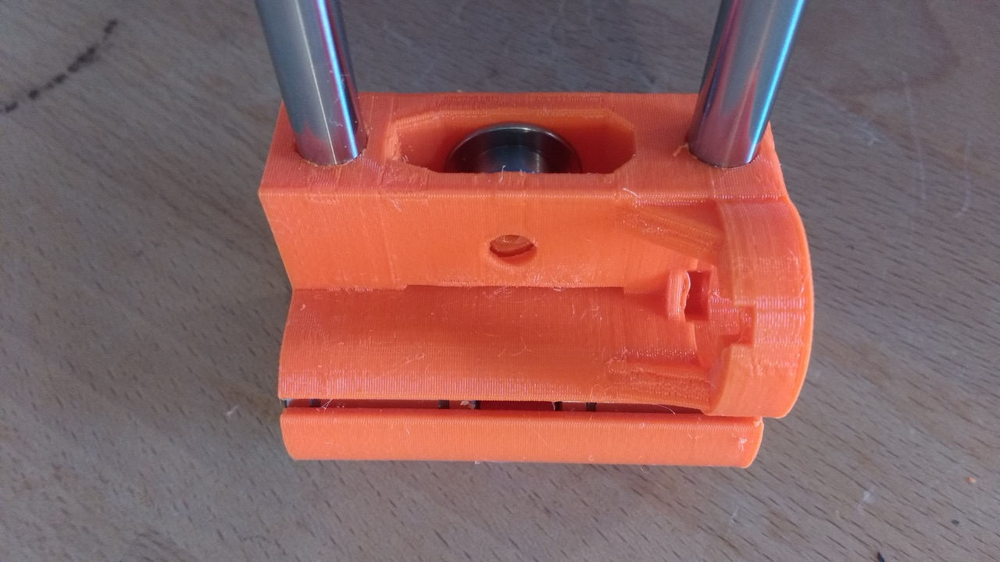

In November 2017 I decided to take the plunge into the world of 3D printing. After much research into the many options available for entry-level printers I found Prusa Research, whose reputation well-preceeded them as being top-of-the-litter in the desktop/hobbiest 3D printer market. At the time they had two main models on offer - the MK2S and the newly released MK3. Both printers are available as kits or pre-assembled. The price of the MK2S was around €150 lower than the MK3.

I decided to buy the MK2S because it seemed like a safer bet going with a printer design that had been around longer and whose issues were known. I also decided to purchase the kit rather than the pre-assembled printer, under the advice of my friend Jarno - who is a 3D printer fanatic (and a huge fan of Prusa Research). Jarno recommended getting a kit because the assembly process of the printer is and important way to 'know your machine', this DIY know-how would be especially important later for tweaking and calibrating the printer.

My plan is to devote one day each weekend, first for assembling the printer and then doing experiments seeing what the machine can do! So.. without further ado. :-)

# Nov 11? Printer Arrives

# The Assembly Manual!

# X-end Idler Assembly Troubles

While assembling my Prusa MK2S kit I hit a snag at [step 7](http://manual.prusa3d.com/Guide/3.+X-axis+assembly/299#s5109) of the X-axis assembly. The problem is that the hexagonal nylock nut didn't fit into its groove at all. Some tips in the comment section of the assembly instructions advised to try and push it in with pliers while tightening the M3 hex screw from the other side.

When I tried this the nut didn't seat - rather, I heard a pretty disheartening **crack** --- the sound of the head of the screw breaking through the plastic of the X-end idler and trapping the bearing!

If the comments on the assembly manual are anything to go by, then I'm not the only one encountering problems with seating that nylock nut in its groove. I really hope the good folks at Prusa Research take a look at adjusting the tolerances on the X-end idler.

I managed to hack together a (temporary?) fix by filing away the broken plastic and using a countersunk M3 screw and a washer to keep the screw from falling into the hole. I haven't finished assembling the kit yet, so I'm not sure if this will work. My main worry is that the screw isn't flush enough against the X-axis idler, potentially making problems later when I assembly the Z-axis.

## Bearing Stuck

Here's the bearing stuck after the hex screw did its damage...

## And the mess after Removing the Bearing

## And my Attempt at a fix

# Duplicate Z-axis part

# Broken bolts in aluminum frame
## Solutions to fixing broken bolts..

# Bed Level Problems...
## Really helpful Prusa MK2S owners facebook page..

After assembling my Prusa MK2S kit I am experiencing a problem with getting even first layers. For some reason, the prints are higher up from the bed on the left than on the right.

Getting the right Z-adjust Level
https://shop.prusa3d.com/forum/prusa-i3-kit-building-calibrating-first-print-main-f6/life-adjust-z-my-way-t2981.html

possibly the y-axis is somehow offkilter (right side higher than the left) ... the pinda is not capable of adjusting for this
https://www.reddit.com/r/3Dprinting/comments/5ximfs/is_the_prusa_i3_mk2_mesh_bed_levelling_not_real/

Video of guy with same issue:
<iframe width="560" height="315" src="https://www.youtube.com/embed/VqgqAyFAb7I" frameborder="0" allow="autoplay; encrypted-media" allowfullscreen></iframe>

## V2Calibration gcode

The calibration print is 'squished' on the right side and sticks well to the bed. The lines get thinner as they go to the left. The lines on the left are not 'squished' and don't stick to the bed.

Apologies for the image - the filament is grey so it is a bit difficult to see against the print bed.

## Here is the bottom of the tree frog included print.
The left side of the print is not well-attached to the bed, the right side is printed very nicely on the first layer.

## Attempts at Troubleshooting

### Live-Z Adjust

### Bed Level Adjust

### Rebuilding/Tightening the Frame
